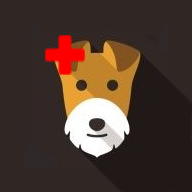
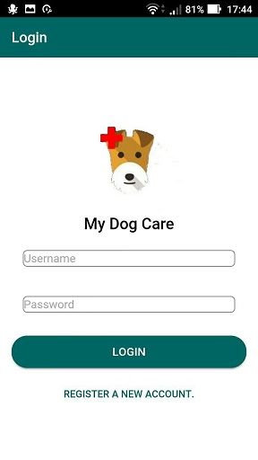

### 

# Product Overview  
With My Dog Care you can track the position of your dog and find near veterinaries. This could be useful if you are in a new city and you do not know where a veterinary is or simply during a walk if you want to know where is your dog. You can also use it to remember visits and vaccines, inserting some useful details like comments and memos. It can also show you a notification, so you do not forget them.

# Screenshots

